<picture>
  <source media="(prefers-color-scheme: dark)" srcset="assets/hero-dark.svg">
  
</picture>

# Dennis Do

I direct AI coding agents, mostly Claude Code, to build and ship real product. Small
organizations near me kept running on spreadsheets and paper because software built for
them did not exist, so I started building it myself and handing it over.

My working pattern is a PRD plus a CLAUDE.md alongside it, so the agent has the same
context I do. That is the difference between directing a build and prompting blindly, and
it is why a one person operation ships at the pace it does. The work I own is finding the
problem, scoping it, deciding the tradeoffs, and getting it in front of real users. The
agent writes the code.

Graduated CS at CUNY Queens College, Summer 2026. Looking for PM and APM roles, and open
to Forward Deployed Engineer work at technical product companies.

---

### 01 / Currently

| | |
|---|---|
| **Running** | MavenStudio, an AI powered web agency I founded with a software engineer partner |
| **Pipeline** | Scrape Google Maps for small businesses with no website, cold call to confirm, then build and deliver |
| **Based in** | Queens, NYC |
| **Open to** | PM and APM roles, plus Forward Deployed Engineer roles |
| **Ask me about** | directing Claude Code, shipping for real users at small scale, NASA L'SPACE, bilingual Korean and English product |

---

### 02 / What I have shipped

Every one of these came from a real conversation with someone who had a real problem. I
scoped it, directed the build, and shipped it into production use.

| Project | The problem, and what I did about it | Built with |
|---|---|---|
| [**AutoBulletin**](https://github.com/DennisD0/JBCHNY-bulletin) | Three staff spent four hours a week assembling a bilingual bulletin by hand in Word, so I scoped a multi user editor that gets it under fifteen minutes. Editor locking came out of watching them overwrite each other. It has held 99% uptime since launch, and nobody there has opened Word for a bulletin since. | Next.js, Puppeteer, GitHub Actions, GCP |
| [**En Hakkore Cafe**](https://cafe-website-flame-rho.vercel.app) | The cafe could only take orders in person, which meant long lines before Sunday service, so I shipped mobile ordering with pickup codes and a live barista queue. Around 20 orders a week. I gated the barista view behind a shared staff PIN to get it live, and that is the first thing I would replace with real role based auth. | React, Vite, Supabase, Vercel |
| [**413 Youth Club**](https://github.com/DennisD0/Basketball-Camp-Website) | Coaches tracked attendance and payments in an Excel sheet they could not update from the court, so I built something they run from a phone during practice. Registration takes roughly 60% less time across 30+ members, though the real change is that coaches stopped doing paperwork at home after practice. | Next.js, Supabase, Prisma, Vercel |

Some of this work stays partly closed. En Hakkore Cafe has a private repo so it links to the
live app, and AutoBulletin runs for church staff so it links to the code instead.

One more worth mentioning, less because anyone is using it and more because of what it took
to get working. [**Choir Player**](https://github.com/DennisD0/Choir-Player)
([live](https://choir-player-744338163103.us-east1.run.app)) turns a hymn number into a
playable, transposable score, which means running optical music recognition on scanned
sheet music inside a container that scales to zero. Recognition on messy scans is genuinely
hard, so the design serves verified scores first and only falls through to recognition when
one does not exist yet, since accuracy mattered more than coverage. I wanted to know how
far I could take a prototype when the hard part is not the interface.

---

### 03 / How I work

**Product**

**Agents I direct**

**What they ship on**

---

<b>04 / Experience</b>

 

**413 Youth Club**, Product Manager (Freelance), Jun 2026, Remote
Used AI tools and agentic development to personally build and validate a member management
platform serving 30+ members, directing delivery rather than relying solely on engineering
handoff. Gathered customer insights through direct interviews with staff, translating
workflow pain points into a prioritized backlog in Linear that reduced registration
processing time by an estimated 60%. Monitored product performance across payment tracking,
registration conversion, and member management workstreams, using dashboard analytics to
inform continuous backlog prioritization.

**En Hakkore Cafe**, Product Manager (Freelance), May 2026, New York
Used AI assisted prototyping to validate a live order queue system before handing
requirements to engineering, reducing back and forth and accelerating delivery for a 20+
weekly order operation. Gathered customer feedback and analyzed order flow data to identify
a failure mode in the payment and tracking workflow, scoping the fix and validating the
solution before it reached users. Maintained documentation and release communications across
order status workflows in Linear, keeping the client aligned through each delivery milestone
with no surprises at go live.

**Scout**, Product Designer, Oct 2025 to Jan 2026, New York
Partnered with engineering and design to support the product lifecycle from discovery
through delivery, mapping requirements in Figma and Miro and tracking the backlog across
multiple workstreams. Gathered customer insights across 2+ sprint cycles and synthesized
feedback in Miro to prioritize the backlog, balancing user needs with technical feasibility
across a cross functional team of 5+. Supported product launches and release communications,
delivering 20+ high fidelity Figma screens within a two week sprint and keeping stakeholders
aligned through on time demo readiness.

**NASA L'SPACE**, Project Manager, May 2025 to Sep 2025, New York
Led an 8 member cross university team across 5 subsystems, running Agile sprint cycles in
Google Workspace and Slack and building Gantt charts to track milestones from kickoff
through final delivery. Used data and analytics to synthesize 20+ NASA and IEEE sources into
a feasibility analysis documenting a 91% cost reduction and 74+ EVA hours saved, turning
research into a decision ready report. Communicated product progress and blockers to NASA
reviewers through structured status updates tailored to technical and nontechnical
audiences, achieving 100% submission approval.

**Research Foundation of CUNY**, Software Engineer Intern, Jul 2023 to Sep 2023, New York
Coordinated across 3 technical teams to track deliverables and ensure all data requests were
completed accurately and on time, supporting campaigns with an 80% client retention rate.
Analyzed data workflows to identify an inefficiency, scoped a process improvement reducing
retrieval time by 15%, and documented the solution with measurable success metrics for
leadership. Communicated findings to technical and nontechnical stakeholders, maintaining
organized documentation that kept all parties aligned throughout the delivery lifecycle.

**Education.** Bachelor of Arts in Computer Science, CUNY Queens College, Queens NY.
Graduating Summer 2026.

**ENERGY ESPORTS**, Founder, high school through freshman year (not on the resume)
Started a competitive amateur team in the mobile FPS Standoff 2 that competed regionally
and internationally, with a Discord community that reached 10,000 members. Closed three
brand sponsorships through cold outreach, structured as discount codes so buyers using our
code saved money. The growth engine was my own YouTube channel,
[ArsenaL FPS](https://youtube.com/@Arsenal_FPS), now past 300,000 views and around 3,400
subscribers.

Also a CodePath Tech Fellow and Intel Ambassador, with hackathons at Berkeley, Columbia,
and HackRPI.

---

The through line is that I cold outreach for what I want and I do the unglamorous part.
Sponsorships from cold emails, clients from cold calls, and configuration work nobody sees.

The fastest way to reach me is email, at **[dennisnasa@gmail.com](mailto:dennisnasa@gmail.com)**.
